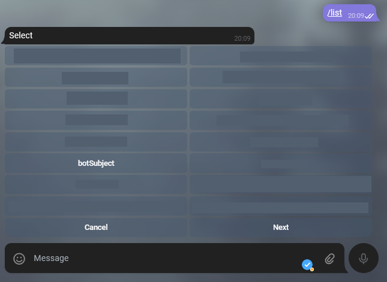
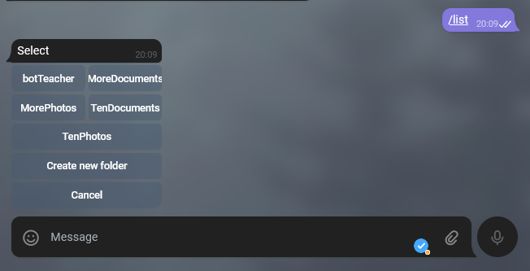
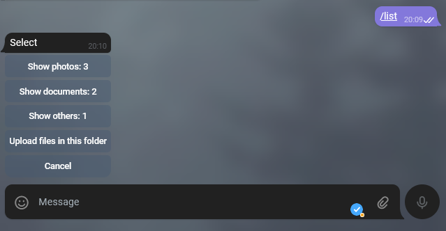
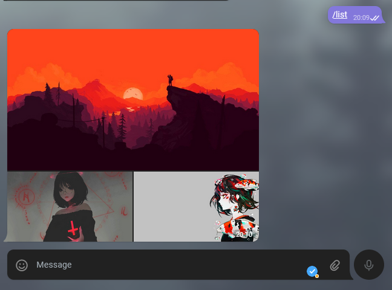
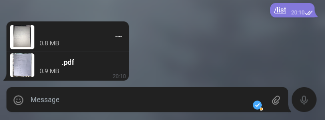
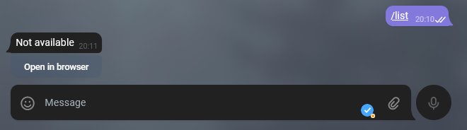
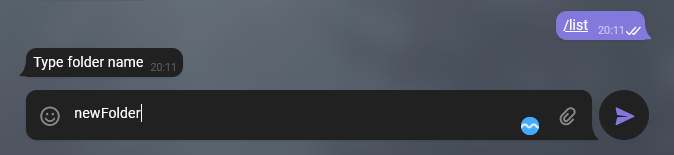
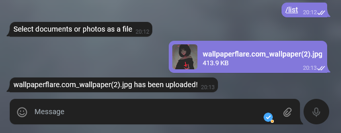

# Telegram Bot with Google Drive API

I made this bot to upload files to specific folders in my drive.

I use a specific workflow:

- **1:** show All folders in **MAIN_FOLDER_ID** / root folder.

- **2:** show All folders that are in the selected folder.

- **3:** Show how many alements are in that folder with specific format(MimeType)
  image/jpeg, application/pdf and others.

**Show all photos**

**Show all PDFs**

**Others takes you to that folder inthe browser**

**extras**

create folders

upload files (can be multiple files at once)

